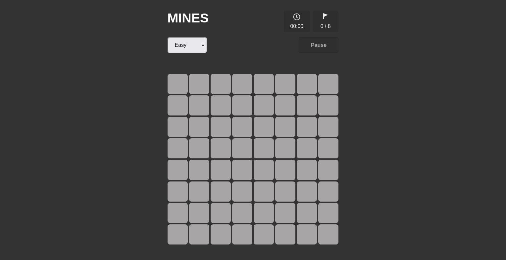

# MINES 

### JavaScript implementation of Minesweeper game.

 

    

 

## Installation

1. Execute `git clone https://github.com/sruthi-98/Mines.git`.

2. Navigate to newly formed folder by running `cd Mines`.

3. Open the index.html file on your browser.